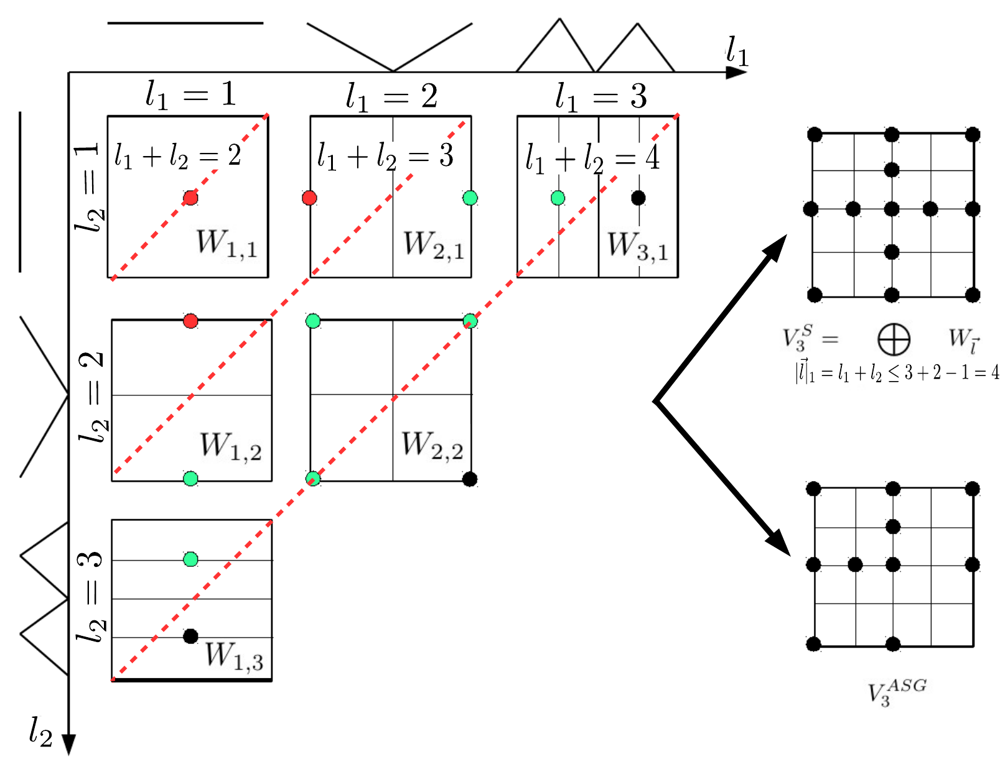

# Sparse Grids for Dynamic Economic Models

<p align="center">

</p>

Sparse grid methods are a versatile tool to compute recursive equilibria in dynamic stochastic economic models. This code repository contains materials
accompanying the review article entitled ["Sparse grids for dynamic economic models"](TBA). 

The goal of this repository is to make sparse grid methods easily accessible to the computational economics and finance community. 
Thus, all illustrative code examples are using [Tasmanian](https://tasmanian.ornl.gov), a high-quality open source sparse grid library. 

### Authors
* [Johannes Brumm](https://johannesbrumm.com/) (Chair of Macroeconomics, Karlsruhe Institute of Technology)
* [Christopher Krause](https://macro.econ.kit.edu/103_170.php) (Chair of Macroeconomics, Karlsruhe Institute of Technology)
* [Andreas Schaab](https://andreasschaab.com/) (Economics division, Columbia Business School)
* [Simon Scheidegger](https://sites.google.com/site/simonscheidegger/) (Department of Economics, University of Lausanne)

### The full review article can be found here
* [LINK TO REVIEW](TBA)

### Illustrative examples

**Analytical Example:** To foster the basic intuition on how to use sparse grids as approximation method, we demonstrate their ability to efficiently interpolate the following n-dimensional (non-smooth) function

![\begin{align*}
f_d(\vec{x}) = \max(0,1-e^{\frac{1}{2}-(\prod_{i=1}^d(x_i+\frac{1}{5}))^{\frac{1}{d}}}),\;\,\text{with}\,\vec{x}=\{x_1,\dots,x_d\}\in[0,1]^d
e\nd{align*}
](https://render.githubusercontent.com/render/math?math=%5CLarge+%5Cdisplaystyle+%5Cbegin%7Balign%2A%7D%0Af_d%28%5Cvec%7Bx%7D%29+%3D+%5Cmax%280%2C1-e%5E%7B%5Cfrac%7B1%7D%7B2%7D-%28%5Cprod_%7Bi%3D1%7D%5Ed%28x_i%2B%5Cfrac%7B1%7D%7B5%7D%29%29%5E%7B%5Cfrac%7B1%7D%7Bd%7D%7D%7D%29%2C%5C%3B%5C%2C%5Ctext%7Bwith%7D%5C%2C%5Cvec%7Bx%7D%3D%5C%7Bx_1%2C%5Cdots%2Cx_d%5C%7D%5Cin%5B0%2C1%5D%5Ed%0A%5Cend%7Balign%2A%7D%0A)

We generate sparse grid as well as adaptive sparse grid approximations to the function and measure their accuracy as follows: We randomly generate 10,000 uniformly distributed test points, and compute the maximum error and the L2-error.

**Benchmark model in discrete time:** To illustrate how (adaptive) sparse grids can be applied to solve economic models in discrete time, we provide an example in python, which solves a multi-country real business cycle model with irreversible invenstment, as presented in [Section 3 of the review article](TBA) (for more details on this model, see also [Brumm & Scheidegger (2017)](https://onlinelibrary.wiley.com/doi/abs/10.3982/ECTA12216)).

**Benchmark model in continuous time:** To illustrate how (adaptive) sparse grids can be applied to solve economic models in continuous time, we provide an example which solves an Aiyagari-type model with a jump in the capital tax rate, as presented in [Section 4 of the review article](TBA) (for more details on this model, see also [Schaab (2020)](https://scholar.harvard.edu/andreasschaab/publications/micro-and-macro-uncertainty))

### Usage

We provide implementations which use python 3.

First, we provide an implementation of the analytic model in two forms. A [jupyter-notebook](https://jupyter.org/) that is self-contained:

[](https://nbviewer.jupyter.org/github/SparseGridsForDynamicEcon/SparseGrids_in_econ_handbook/blob/master/Analytical_example/2D_example.ipynb)

as well as a plain python script, which can be executed from the command line:

[](Analytical_example)


The benchmark IRBC model code can be found here:

[](IRBC_model)


The benchmark Aiyagari model code can be found here:

[](TBA)


### Prerequisites / Installation

To run the code with the analytical examples, follow the instructions below. For instructions on how to run the benchmark international real business cycle (IRBC) model, see the corresponding instructions here: [IRBC README](IRBC_model).


**TASMANIAN 7.7**

Tasmanian is included in the Python Pip index: https://pypi.org/project/Tasmanian/

```shell
$ python3 -m pip install scikit-build packaging numpy --user (required dependencies)
$ python3 -m pip install Tasmanian --user                    (user installation)
$ python3 -m pip install Tasmanian                           (virtual env installation) 
```
Further information on alternative installation procedures can be found here: https://tasmanian.ornl.gov/documentation/md_Doxygen_Installation.html

## Support
This work is generously supported by grants from the [Swiss National Science Foundation](https://www.snf.ch) under project IDs “New methods for asset pricing with frictions”, "Can economic policy mitigate climate change", and the [Enterprise for Society (E4S)](https://e4s.center).

## Citation
Please cite this handbook in your publications if it helps your research:

Brumm, Johannes and Krause, Christopher and Schaab, Andreas and Scheidegger, Simon (2021); Sparse grids for dynamic economic models


```
@article{SG_in_econ_handbook,
author = {Brumm, Johannes and Krause, Christopher and Schaab, Andreas and Scheidegger, Simon},
title = {Sparse Grids for Dynamic Economic Models},
year = {2021}
}
```
